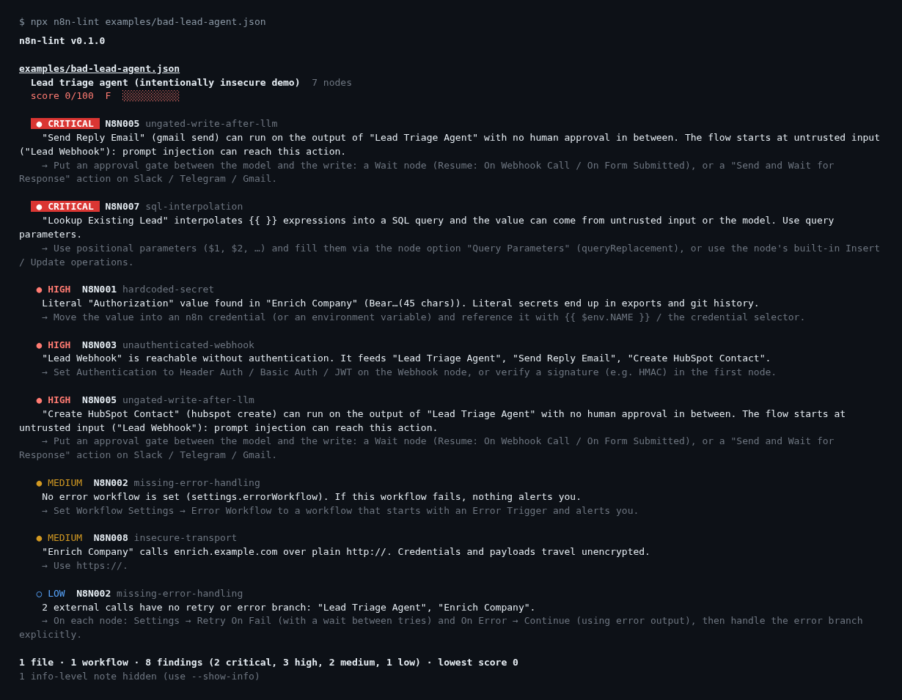
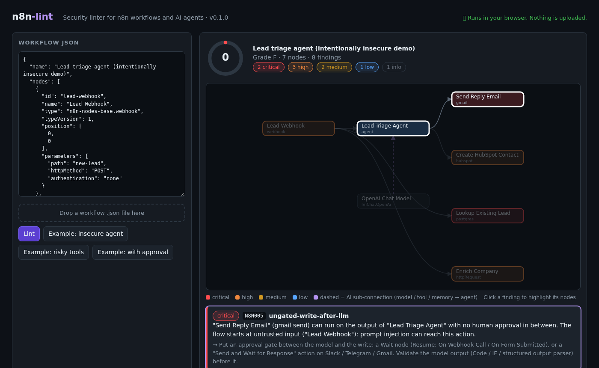

# n8n-lint

**ESLint for n8n workflows — with a focus on AI agents.**
Finds hard-coded secrets, open webhooks, and — the important part — **paths where an LLM's output can trigger an email, a CRM write, a payment or a `DELETE` with no human in between.**

Zero dependencies · Node ≥ 18 · CLI + GitHub Action + offline web UI · SARIF for code scanning



## Why

Workflow JSON is code that gets exported, pasted into forums and committed to git. In 2025–26 it also became code that *an LLM steers*. Existing n8n checks stop at "is the JSON valid". n8n-lint reads the **graph** (triggers → models → tools → writes) and answers security questions about it:

- Can an **unauthenticated webhook** reach an agent that has a **Send Email** tool?
- Is there an **approval step** (Wait / "Send and wait for response") between the model and the write?
- Is the "please confirm first" rule enforced by the workflow, or only **asked politely in the prompt**?



## Try it (no install)

Open [`web/index.html`](web/index.html) in a browser (or host it on GitHub Pages), paste a workflow (in n8n: select all nodes → Ctrl+C), get a score and a graph. It runs 100 % client-side; nothing is uploaded.

## CLI

```bash
npx n8n-lint workflows/                 # a folder (recursive) or files
npx n8n-lint wf.json --fail-on medium   # stricter gate
cat wf.json | npx n8n-lint -            # stdin
npx n8n-lint workflows/ -f sarif -o n8n-lint.sarif
npx n8n-lint --explain N8N005           # what it means, bad vs good example
```

Until it is published to npm, run it from a clone: `node bin/n8n-lint.js <path>`.

| Option | |
|---|---|
| `-f, --format` | `pretty` (default), `json`, `sarif`, `markdown`, `badge` (SVG) |
| `-o, --output <file>` | write the report to a file |
| `--fail-on <sev>` | `critical` · `high` (default) · `medium` · `low` · `none` |
| `--min-score <n>` | fail if any workflow scores below *n* |
| `-c, --config <file>` | default `./.n8nlintrc.json` ([example](docs/n8nlintrc.example.json)) |
| `--show-info` | also show info-level notes |

Exit codes: `0` ok · `1` findings at/above `--fail-on` (or score < `--min-score`) · `2` bad input / usage.
Understands a single workflow, the n8n clipboard export, the `api.n8n.io/templates` wrapper, and arrays of workflows.

## GitHub Action

```yaml
# .github/workflows/n8n-lint.yml
name: n8n-lint
on: [pull_request]
permissions:
  contents: read
  security-events: write   # for sarif: true
  pull-requests: write     # for comment: true
jobs:
  lint:
    runs-on: ubuntu-latest
    steps:
      - uses: actions/checkout@v4
      - uses: therealfullmetal55555/n8n-lint@v0   # pin to a tag once released
        with:
          path: workflows/
          fail-on: high
          sarif: true      # findings show up in the Security tab
          comment: true    # one summary comment per PR, updated in place
```

It always writes a summary to the job page. See [`action.yml`](action.yml).

## Rules

| ID | Finds | Default |
|---|---|---|
| N8N001 | Hard-coded API keys, tokens, `Authorization` headers, private keys | high / critical |
| N8N002 | No error workflow, external calls without retry or error branch | medium |
| N8N003 | Webhook / form / public chat without authentication | high |
| N8N004 | Cycles without a bound; agents with `maxIterations` > 25 | medium / high |
| N8N005 | **LLM output → write with no approval gate** | high / critical |
| N8N006 | **Agent has a tool that sends / creates / deletes** (confirmation only in the prompt) | high / critical |
| N8N007 | SQL built with `{{ }}` instead of query parameters | high / critical |
| N8N008 | `http://` to a remote host, "Ignore SSL issues" | medium |
| N8N009 | Real-looking emails / phones / tokens in `pinData` | medium |
| N8N010 | Disabled or unreachable nodes | low |
| N8N011 | Shell execution (`Execute Command`, `SSH`) | high / critical |
| N8N012 | `eval` / `child_process` / `subprocess` in Code nodes | medium / critical |

Details, reasons and before/after fixes: [docs/RULES.md](docs/RULES.md).

**Severity is contextual.** The same Telegram message node is `low` when it logs, `medium`–`high` when an untrusted trigger can steer it, and an email send reachable from an open webhook through an LLM is `critical`. Replying to the Telegram user who wrote to the bot is not flagged. A Gmail *draft* is a low-impact write; a *send* is not. Approval nodes (`Wait`, any `sendAndWait`) block propagation.

**Score** = 100 − (critical 30, high 15, medium 7, low 3); any critical caps the score at 59. Grades: A ≥ 90, B ≥ 75, C ≥ 60, D ≥ 40, F below.

## Suppressing and configuring

```text
Node → Notes:   reviewed with security, internal traffic only. n8n-lint-disable N8N005
Sticky note:    n8n-lint-disable-workflow            (all rules, this workflow)
Sticky note:    n8n-lint-disable-workflow N8N003, N8N002
```

```json
{ "failOn": "high", "ignore": ["workflows/archive/**"], "rules": { "N8N002": "low", "N8N010": "off" } }
```

## Library

```js
import { lintDocument } from 'n8n-lint';
const [result] = lintDocument(JSON.parse(json), { rules: { N8N010: 'off' } });
console.log(result.score, result.findings);
```

## What it found on real workflows

Run on 20 workflows from my own n8n repos and 6 public templates from n8n.io (no rule tuning per file):

| Set | Workflows | Score range | Findings |
|---|---|---|---|
| my repos | 20 | 51 – 100 (11 of 20 scored ≥ 93) | 5 high, 12 medium, 23 low, 7 info |
| public templates | 6 | 45 – 90 | 3 high, 7 medium, 6 low, 6 info |

The high findings are true positives that matter: an AI executive assistant whose "ask before booking" rule lives only in the prompt, an inbox router that creates HubSpot deals and Zendesk tickets straight from an LLM classification, a public webhook feeding a RAG agent. In the first pass the tool was far too loud (every chatbot reply was *critical*); the impact/context model above is the fix, and several of the tests exist because of false positives found that way.

## Limitations (please read)

- **Static heuristics, not a proof.** It cannot know what an expression evaluates to, what your credentials allow, or what a sub-workflow does. Expect some false positives and misses; suppress with a note and a reason.
- Custom/community nodes are unknown to it: a write through an unrecognised node is **not** detected. HTTP `POST` is treated as a write only when the URL/name does not look like a read (search, embed, query…).
- `Execute Workflow` / sub-workflows are not followed across files.
- Validated on the 26 real workflows above plus synthetic tests, not on every n8n version or node; the GitHub Action has been validated for YAML and simulated locally, but not on GitHub's runners yet.
- It does not replace n8n's own security hardening, network policy, or credential scoping.

## Development

```bash
npm test                # node:test, no dependencies
npm run check           # tests + examples + regenerated docs/web are up to date
npm run build:web       # web/index.html is generated from src/
npm run docs            # docs/RULES.md is generated from the rule definitions
```

Adding a rule: create `src/rules/n8nNNN-….js` (id, name, severity, why, fix, bad, good, `check`), register it in `src/rules/index.js`, add tests, run `npm run docs && npm run build:web`.

## По-русски (коротко)

**n8n-lint** — линтер безопасности для воркфлоу n8n, особенно для AI-агентов. Анализирует не только JSON, но и *граф*: может ли выход LLM без подтверждения человеком привести к отправке письма, записи в CRM, платежу или `DELETE`; открыт ли вебхук без авторизации; зашиты ли ключи; собран ли SQL через `{{ }}`.
Запуск: `node bin/n8n-lint.js workflows/` · онлайн-версия без установки: `web/index.html` (всё считается в браузере). Подавление: `n8n-lint-disable N8N005` в Notes ноды. Есть GitHub Action (SARIF + комментарий в PR). Это эвристики: возможны ложные срабатывания.

## License

MIT © Kirill Tsyganov
